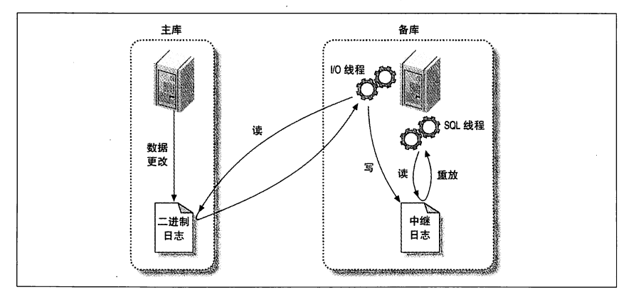
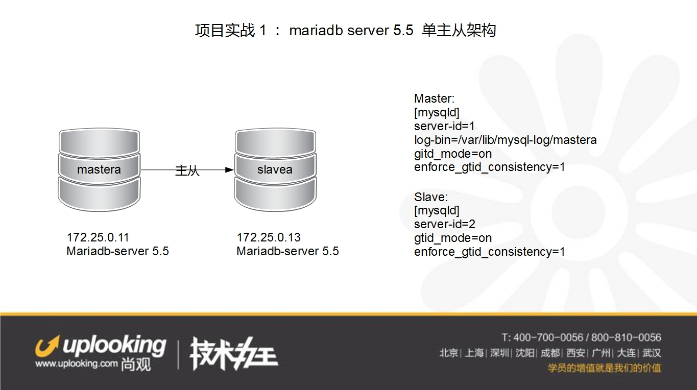
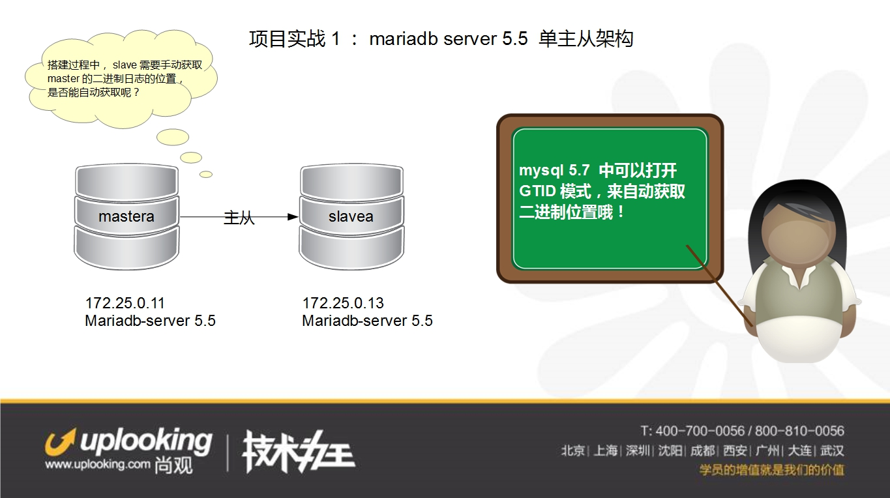
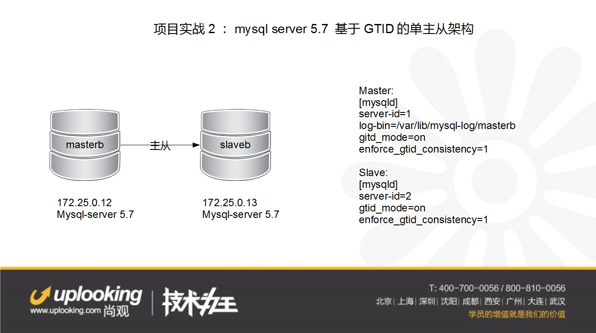
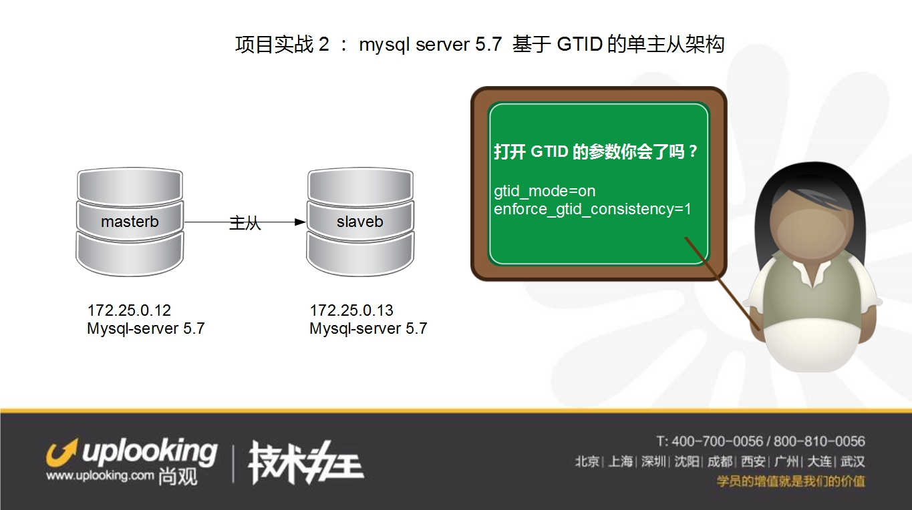
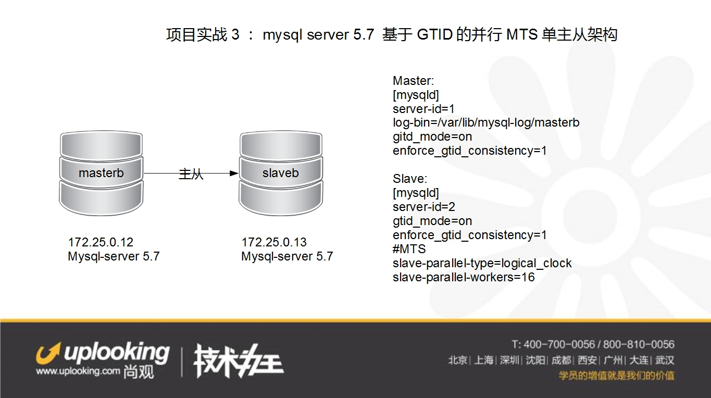
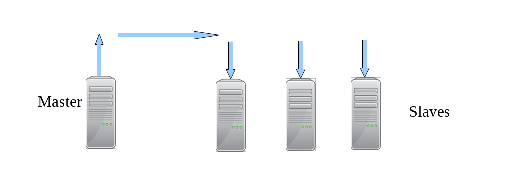
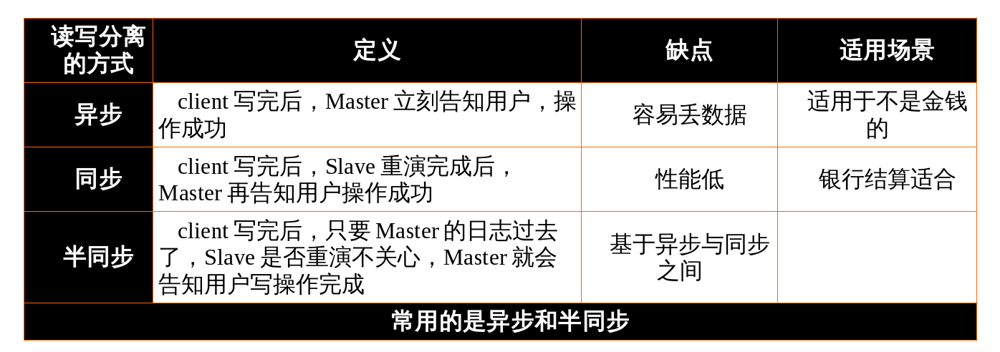
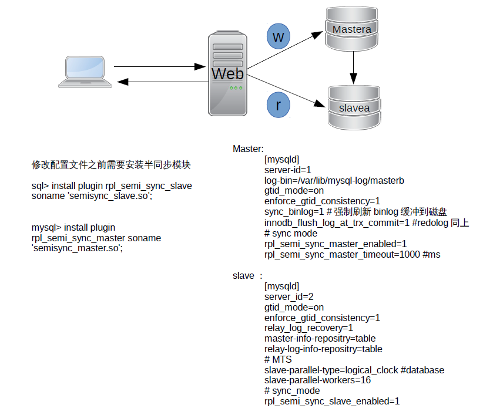
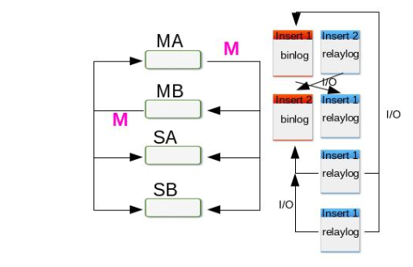

## 复制 AB replication

[TOC]

> 本讲义参考 《 HA mysql 》 高可用MySQL:第2版 /(美)贝尔(Bell,C.),(美)肯德尔(Kindahl,M.),(美)塞尔曼

### 复制概述

数据库为应用程序提供高可用性和可扩展性的重要特性之一就是复制(Replication)。复制在数据库层创建冗余,同时产生多个数据库副本进行读扩展。

复制就是把某个服务器上(称为 主节点服务器 或者简称 主节点 ,即 master)的所有变化克隆到另一个服务器(称为 从节点服务器 或简称 从节点 ,即 slave)。复制通常用来创建master 的一个可靠副本,不过复制也有其他用途。

两种最常见的使用复制的例子是 :

* (1)创建一个 master 的备份,以避免 master 崩溃时丢失数据 ;
* (2)创建一个 master 的副本,从而在不干扰其他业务的情况下执行报表和分析工作。

对小型企业来说,这足以简化很多事情,但复制可以做得更多,比如 :

* 支持多个机房

每个地点都可能要维护服务器,然后将变更复制到其他地方,从而使得信息处处可用。这就需要保护数据,在合法的情况下,保证用于审计目的的业务信息可用。

* 即使有服务器停机,也能保证业务的持续运行

如果原来的服务器失效,由其他服务器处理所有的访问量。

* 即使有灾难发生,也能保证业务持续运行

复制可以将变更发送给不同地理位置的其他数据中心。

* 错误保护(oops)

当 slave 连接 master 时,可从总是比 master 落后一个固定的时间周期(例如 1 小时),这样就会产生一个 延迟的 slave(Delayed Slave)。如果这时 master 上发生错误,可以找到出错的语句,然后在 slave 执行之前删除它。

目前很多应用程序中使用复制最重要的场景之一就是 横向扩展 (scale out)。现今的应用程序通常是读密集型的,具有高读写比。为了减少 master 上的负载,你可以搭建一个专门响应读请求的 slave。通过一个负载均衡器,可以将读请求定向到合适的 slave,而写请求则交给 master 处理。

在横向扩展的场景下使用复制时,理解 MySQL 复制的 异步性 (asynchronous)很重要,即事务首先在 master 上提交,然后复制到 slave 并在 slave 上执行。这意味着 master 和slave 可能并不一致,而且如果复制持续运行,slave 将会落后于 master。

使用异步复制的好处在于它比同步复制更快、更具可扩展性,但在那些实时数据很重要的情况下,必须处理好不同步的问题以保证信息的时效性。

然而,读扩展并不足以适用于所有应用程序。随着需求增加,数据库更大,写负载更高,需要扩展的就不只是读操作了。管理大型数据库,提升大型数据库系统的性能,可以通过分片 (sharding)技术来实现。通过分片,可以将数据库划分为若干可管理的数据分片,将数据库分发到多个服务器上,从而增加数据库的规模,并有效地扩展写操作。

复制的另一个重要应用是通过添加冗余来保证高可用性。最常见的技术是使用 双主配置(dual-master),即通过复制保持一对 master 总是可用,其中每个 master 都是对方的镜像。如果其中一个 master 失效,另一个会立即接手。

除了双主配置,还有其他与复制无关的高可用性技术,如使用共享存储或复制磁盘。尽管它们不是 MySQL 特有的,但这些技术对于保证高可用性来说也是很重要的工具


### 复制解决的问题

> 复制用例:

>> 通过热备份达到高可用性

如果服务器宕机,一切都将停止 :不能执行(可能很关键的)事务, 无法得到用户信息,也不能检索其他重要数据。要不惜(几乎)一切代价避免这种情况发生,因为它会严重破坏业务。最简单的方法就是配置一个额外的服务器专门作为热备份(hot standby),在主服务器宕机的时候随时接管业务。

如果数据库只做了备份，现在数据库坏了，我们要恢复数据库，可能要花几个小时；但是现在我们希望这台数据库坏了，另外一台能够立刻顶上使用，该怎么做呢？

那就需要我们有一个冗余的环境，备份是备份,冗余是冗余。概念不一样,备份是将数据以隔离的方式保存,备份的缺点,他不是瞬间还原,备份在还原过程中是有耗时的,他不是瞬间还原,例如,我们有几百个 G 的文件要还原回去,慢慢拷吧,几个小时。冗余不一样,主服务器/从服务器,主服务器坏掉,从服务器就顶上工作,所以冗余在可用性上来讲,恢复的速度上来讲,比备份来的快,但是冗余有他的缺点,备份有他的优点,比如我们作主从同步,主服务器和从服务器数据都一样的,如果主服务器上有人错删了一个表,我们把这种操作称为误操作,那么从服务器也会发生误操作,所以呢,冗余不能解决人为的误操作,而备份可以解决。冗余他能解决硬件故障,但是误操作无法解决,备份不是瞬间还原,但是既可以解决硬件故障又能解决误操作,他们各有优劣点,而真实的线上生产环境是两种方法一起使用,既有冗余环境,又有周期性备份,管理员要周期性地进行备份,同时有多台服务器作冗余。

>> 产生报表

直接用服务器上的数据创建报表将大大降低服务器的性能,在某些情况下尤其显著。如果产生报表需要大量的后台作业,最好创建一个额外的服务器来运行这些作业。停止报表数据库上的复制,然后在不影响主要业务服务器的情况下运行大量查询,从而得到数据库在某一特定时间的快照。例如,如果在每天最后一个事务处理完毕后停止复制,可以提取日报表而其他业务仍正常运转。

>> 调试和审计

还可以审查服务器上的查询。例如,查看某些查询是否有性能问题,以及服务器是否由于某个糟糕的查询而不同步。

### 复制的原理

在详细介绍如何设置复制之前，让我门先看看MySQL实际上时如何复制数据的。总的来说，复制有三个步骤：

1. 在主库上把数据更改记录到二进制日志（Binary Log）中（这写记录被称为二进制日志事件）。
2. 备库将主库的日志复制到自己的中继日志（Relay Log）中。
3. 备库读取中继日志中的事件，将其重放/重演到备库数据之上。

以上只是概述，实际商每一步都很复杂，下图更详细地描述了复制的细节。



#### 项目实战1：mariadb server 5.5 单主从架构



*单主从步骤*

~~~
	# 主服务器
	1）修改配置文件	log-bin server-id=1（重启服务）
	2）授权从机	grant replication slave to slave@172.25.0.12 uplooking
	3）初始化数据一致	mysqldump---》传输给从机器

	# 从服务
	1）install
	2）修改配置文件	server-id=2
	3）初始化数据一致	导入全备数据
	4）> change master master_host='172.25.0.11'
			master_user='slave'
			master_password='uplooking'
			master_log_file=''
			master_log_pos=''
	5)> start slave;
	6)> show slave status\G;
~~~


```shell
## 主服务器
[root@mastera0 mysql]# vim /etc/my.cnf
[root@mastera0 mysql]# grep -v '^#' /etc/my.cnf|grep -v '^$'
[mysqld]
datadir=/var/lib/mysql
socket=/var/lib/mysql/mysql.sock
symbolic-links=0
log-bin=/var/lib/mysql-log/mastera
server-id=1
[mysqld_safe]
log-error=/var/log/mariadb/mariadb.log
pid-file=/var/run/mariadb/mariadb.pid
!includedir /etc/my.cnf.d

[root@mastera0 mysql]# systemctl restart mariadb
[root@mastera0 mysql]# mysql -uroot -puplooking
Welcome to the MariaDB monitor.  Commands end with ; or \g.
Your MariaDB connection id is 2
Server version: 5.5.44-MariaDB-log MariaDB Server

Copyright (c) 2000, 2015, Oracle, MariaDB Corporation Ab and others.

Type 'help;' or '\h' for help. Type '\c' to clear the current input statement.

MariaDB [(none)]> grant replication slave on *.* to slave@'172.25.0.12' identified by 'uplooking';
Query OK, 0 rows affected (0.00 sec)

MariaDB [(none)]> flush privileges;
Query OK, 0 rows affected (0.00 sec)

MariaDB [(none)]> \q
Bye
[root@mastera0 mysql]# mysqldump -uroot -puplooking -A --single-transaction --master-data=2 --flush-logs > /tmp/mysql.91.sql
[root@mastera0 mysql]# scp /tmp/mysql.91.sql root@172.25.0.12:/tmp
The authenticity of host \'172.25.0.12 (172.25.0.12)\' can\'t be established.
ECDSA key fingerprint is 91:2b:bd:df:0e:17:da:a0:f6:01:ff:5b:09:50:e8:ad.
Are you sure you want to continue connecting (yes/no)? yes
Warning: Permanently added '172.25.0.12' (ECDSA) to the list of known hosts.
root@172.25.0.12\'s password:
mysql.91.sql                                                      100%  505KB 504.7KB/s   00:00    

## 从服务器
[root@masterb0 ~]# yum install -y mariadb-server
[root@masterb0 ~]# vi /etc/my.cnf
[root@masterb0 ~]# systemctl start mariadb
[root@masterb0 ~]# mysql < /tmp/mysql.91.sql
[root@masterb0 ~]# mysql
Welcome to the MariaDB monitor.  Commands end with ; or \g.
Your MariaDB connection id is 3
Server version: 5.5.44-MariaDB MariaDB Server

Copyright (c) 2000, 2015, Oracle, MariaDB Corporation Ab and others.

Type 'help;' or '\h' for help. Type '\c' to clear the current input statement.

MariaDB [(none)]> flush privileges;
Query OK, 0 rows affected (0.00 sec)

MariaDB [(none)]> \q
Bye
[root@masterb0 ~]# mysql
ERROR 1045 (28000): Access denied for user 'root'@'localhost' (using password: NO)
[root@masterb0 ~]# mysql -uroot -puplooking
Welcome to the MariaDB monitor.  Commands end with ; or \g.
Your MariaDB connection id is 5
Server version: 5.5.44-MariaDB MariaDB Server

Copyright (c) 2000, 2015, Oracle, MariaDB Corporation Ab and others.

Type 'help;' or '\h' for help. Type '\c' to clear the current input statement.

MariaDB [(none)]>


MariaDB [(none)]> change master to master_host='172.25.0.11',master_user='slave',master_password='uplooking',master_log_file='mastera.000028',MASTER_LOG_POS=245;
Query OK, 0 rows affected (0.21 sec)

MariaDB [(none)]> start slave;
Query OK, 0 rows affected (0.00 sec)

MariaDB [(none)]> show slave status\G;
*************************** 1. row ***************************
               Slave_IO_State: Waiting for master to send event
                  Master_Host: 172.25.0.11
                  Master_User: slave
                  Master_Port: 3306
                Connect_Retry: 60
              Master_Log_File: mastera.000028
          Read_Master_Log_Pos: 245
               Relay_Log_File: mariadb-relay-bin.000002
                Relay_Log_Pos: 527
        Relay_Master_Log_File: mastera.000028
             Slave_IO_Running: Yes
            Slave_SQL_Running: Yes
              Replicate_Do_DB:
          Replicate_Ignore_DB:
           Replicate_Do_Table:
       Replicate_Ignore_Table:
      Replicate_Wild_Do_Table:
  Replicate_Wild_Ignore_Table:
                   Last_Errno: 0
                   Last_Error:
                 Skip_Counter: 0
          Exec_Master_Log_Pos: 245
              Relay_Log_Space: 823
              Until_Condition: None
               Until_Log_File:
                Until_Log_Pos: 0
           Master_SSL_Allowed: No
           Master_SSL_CA_File:
           Master_SSL_CA_Path:
              Master_SSL_Cert:
            Master_SSL_Cipher:
               Master_SSL_Key:
        Seconds_Behind_Master: 0
Master_SSL_Verify_Server_Cert: No
                Last_IO_Errno: 0
                Last_IO_Error:
               Last_SQL_Errno: 0
               Last_SQL_Error:
  Replicate_Ignore_Server_Ids:
             Master_Server_Id: 1
1 row in set (0.00 sec)

ERROR: No query specified

MariaDB [(none)]>
MariaDB [(none)]> select * from db1.t1;
+-----+
| id  |
+-----+
|   3 |
|   4 |
|   5 |
|   6 |
|   7 |
|   8 |
|   9 |
|  10 |
|  11 |
|  12 |
|  13 |
|  14 |
| 100 |
| 101 |
| 102 |
| 103 |
| 777 |
+-----+
17 rows in set (0.00 sec)

MariaDB [(none)]> \q
Bye
```



#### 项目实战2：mysql server 5.7 基于GTID的单主从架构



|server|ip|software|rule|
|:--|:--|:--|:--|
|masterb|172.25.0.12|mysql-server 5.7|master|
|slaveb|172.25.0.14|mysql-server 5.7|slave|

配置文件如下：

```shell
Master:
[mysqld]
server-id=1
log-bin=/var/lib/mysql-log/mastera
gitd_mode=on
enforce_gtid_consistency=1

Slave:
[mysqld]
server-id=2
gtid_mode=on
enforce_gtid_consistency=1
```

其他步骤与项目实践类似，再次不再赘述




### 复制中的延迟问题_重演延迟

- mysql5.5之前没有解决方案——单线程
- mysql5.6（mariadb10）开始——一库一线程
- mysql5.7（mariadb10.1）真正解决了——一组一线程


#### 项目实战3：mysql server 5.7 基于GTID的并行MTS单主从架构



MTS参数是在slave上设置：
slave-parallel-type=logical_clock
slave-parallel-workers=16

salve-parallel-type的选项有：
1. logical_clock	一组一线程
2. database 一库一线程

#### 项目实战4：mysql server 5.7 基于GTID的并行MTS单主从架构crash safe参数调优

Master
sync_binlog=1 #强制刷新binlog到磁盘
innodb_flush_log_at_trx_commit=1 #强制刷新redolog到磁盘

Slave
relay_log_recovery=1 #如果slave的中继日志出问题，能够再次自动获取master的二进制日志


### 复制中的延迟问题_读写分离



主服务器写入，同步到从服务器，在从服务器中读取数据，一般一台主服务器，多台从服务器(5.7版本以后支持多master，之前都是一个master )





#### 项目实战5：mysql server 5.7 基于GTID的并行MTS单主从半同步架构




### 复制中的单点故障问题

#### 复制拓扑_配置M-S-S

有很多复杂的拓扑结构，但即使是最简单的也可能会非常灵活。一种拓扑可以有多种用途。

接下来我们讨论一些比较普遍的拓扑结构以及它们的优缺点。记住下面的基本原则：

* 每个备库必须有一个唯一的服务器ID
* 一个主库可以有多个备库
* mysql5.7开始一个备库可以有多个主库(multisource replication)
* 如果打开了log_save_updates选项，一个备库可以把其主库上的数据变化传播到其他备库


一主库多备库的结构，备库之间没有交互，它们仅仅是连接到同一个主库上。


尽管这是非常简单的拓扑结构，但它非常灵活，能满足多种需求。

*用途：*

* 为不同的角色使用不同的备库（例如添加不同的索引或使用不同的存储引擎）。
* 把一台备库当作待用的主库，除了复制没有其他数据传输。
* 将一台备库放到远程数据中心，用作灾难恢复。
* 延迟一个或多个备库，以备灾难恢复。
* 使用其中一个备库，作为备份、培训或者测试使用服务器。

*优点* ：避免了很多其他拓扑结构的复杂性。


#### 复制拓扑_配置M-M

*主主复制（也叫做双主复制或双向复制）* 包含两台服务器，每一个都被配置成对方的主库和备库，还句话说，它们是一对主库。


*应用场景* 通常用于特殊的目的。一个可能的应用场景是两个位于不同地理位置的办公室，并且都需要一份可写的数据拷贝。

*最大的问题* 两个可写的互主服务器导致的问题非常多。这通常发生在两台服务器同时修改一行记录，或同时在量太服务器上向一个包含`auto_increment`列的表里插入数据。

总的来说，允许向两台服务器上写如带来的麻烦远远大于其带来的好处。

*双主步骤*

~~~
mastera masterb
主	      从     已完成
从	      主
	# 主服务器 masterb
	1）修改配置文件	log-bin=/var/lib/mysql-log/masterb
			server-id=2（重启服务）
			mkdir /var/lib/mysql-log/	--ugo,selinux
	2)> show master status\G;

	# 从服务 mastera
	1）授权从机	grant replication slave to slave@172.25.0.11 uplooking   
			(masterb > show grants for slave@172.25.0.11;)
	2）> change master master_host='172.25.0.12'
			master_user='slave'
			master_password='uplooking'
			master_log_file=''
			master_log_pos=''
	3)> start slave;
	4)> show slave status\G;
	5)测试
~~~

> 实现 mariadb 5.5 MySQL AB 复制 M-M部署

```shell
# 双主从
[root@masterb0 ~]# vi /etc/my.cnf
[root@masterb0 ~]# grep -v '^#' /etc/my.cnf|grep -v '^$'
[mysqld]
datadir=/var/lib/mysql
socket=/var/lib/mysql/mysql.sock
symbolic-links=0
server-id=2
log-bin=/var/lib/mysql-log/masterb
[mysqld_safe]
log-error=/var/log/mariadb/mariadb.log
pid-file=/var/run/mariadb/mariadb.pid
!includedir /etc/my.cnf.d

[root@masterb0 ~]# mkdir /var/lib/mysql-log/
[root@masterb0 ~]# chown mysql. /var/lib/mysql-log/
[root@masterb0 ~]# getenforce
Permissive
[root@masterb0 ~]# systemctl restart mariadb

## 通过在mastera上添加授权，同步给masterb，允许mastera对masterb有replication slave的权限

[root@mastera0 ~]# mysql -uroot -puplooking
Welcome to the MariaDB monitor.  Commands end with ; or \g.
Your MariaDB connection id is 7
Server version: 5.5.44-MariaDB-log MariaDB Server

Copyright (c) 2000, 2015, Oracle, MariaDB Corporation Ab and others.

Type 'help;' or '\h' for help. Type '\c' to clear the current input statement.

MariaDB [(none)]> grant replication slave on *.* to slave@'172.25.0.11' identified by 'uplooking';
Query OK, 0 rows affected (0.00 sec)

MariaDB [(none)]> flush privileges;
Query OK, 0 rows affected (0.00 sec)

## 到masterb上检查是否已经同步到对mastera的授权信息

[root@masterb0 ~]# mysql -uroot -puplooking
Welcome to the MariaDB monitor.  Commands end with ; or \g.
Your MariaDB connection id is 4
Server version: 5.5.44-MariaDB-log MariaDB Server

Copyright (c) 2000, 2015, Oracle, MariaDB Corporation Ab and others.

Type 'help;' or '\h' for help. Type '\c' to clear the current input statement.

MariaDB [(none)]> show grants for slave@172.25.0.11;
+----------------------------------------------------------------------------------------------------------------------------+
| Grants for slave@172.25.0.11                                                                                               |
+----------------------------------------------------------------------------------------------------------------------------+
| GRANT REPLICATION SLAVE ON *.* TO 'slave'@'172.25.0.11' IDENTIFIED BY PASSWORD '*6FF883623B8639D08083FF411D20E6856EB7D2BF' |
+----------------------------------------------------------------------------------------------------------------------------+
1 row in set (0.00 sec)

## 查看当前masterb的日志写到哪里了，哪个位置了

MariaDB [(none)]> show master status\G;
*************************** 1. row ***************************
            File: masterb.000001
        Position: 245
    Binlog_Do_DB:
Binlog_Ignore_DB:
1 row in set (0.00 sec)


## 在mastera上操作，change master to

MariaDB [(none)]> change master to master_host='172.25.0.12',master_user='slave',master_password='uplooking',master_log_file='masterb.000001',master_log_pos=245;
Query OK, 0 rows affected (0.20 sec)

MariaDB [(none)]> start slave;
Query OK, 0 rows affected (0.00 sec)

MariaDB [(none)]> show slave status\G;
*************************** 1. row ***************************
               Slave_IO_State: Waiting for master to send event
                  Master_Host: 172.25.0.12
                  Master_User: slave
                  Master_Port: 3306
                Connect_Retry: 60
              Master_Log_File: masterb.000001
          Read_Master_Log_Pos: 245
               Relay_Log_File: mariadb-relay-bin.000002
                Relay_Log_Pos: 527
        Relay_Master_Log_File: masterb.000001
             Slave_IO_Running: Yes
            Slave_SQL_Running: Yes
              Replicate_Do_DB:
          Replicate_Ignore_DB:
           Replicate_Do_Table:
       Replicate_Ignore_Table:
      Replicate_Wild_Do_Table:
  Replicate_Wild_Ignore_Table:
                   Last_Errno: 0
                   Last_Error:
                 Skip_Counter: 0
          Exec_Master_Log_Pos: 245
              Relay_Log_Space: 823
              Until_Condition: None
               Until_Log_File:
                Until_Log_Pos: 0
           Master_SSL_Allowed: No
           Master_SSL_CA_File:
           Master_SSL_CA_Path:
              Master_SSL_Cert:
            Master_SSL_Cipher:
               Master_SSL_Key:
        Seconds_Behind_Master: 0
Master_SSL_Verify_Server_Cert: No
                Last_IO_Errno: 0
                Last_IO_Error:
               Last_SQL_Errno: 0
               Last_SQL_Error:
  Replicate_Ignore_Server_Ids:
             Master_Server_Id: 2
1 row in set (0.00 sec)

ERROR: No query specified

## 测试 在masterb上写数据，测试mastera是否能够同步到
MariaDB [(none)]> insert into db1.t1 values (100);
Query OK, 1 row affected (0.06 sec)

## 在mastera上查看db1.t1表是否同步到数据了

MariaDB [(none)]> select * from db1.t1;
+-----+
| id  |
+-----+
|   1 |
|   2 |
| 100 |
+-----+
3 rows in set (0.00 sec)
ERROR: No query specified

MariaDB [(none)]>
MariaDB [(none)]> insert into db1.t1 values (100);
Query OK, 1 row affected (0.06 sec)

MariaDB [(none)]> select * from db1.t1;
+-----+
| id  |
+-----+
|   1 |
|   2 |
| 100 |
+-----+
3 rows in set (0.00 sec)

MariaDB [(none)]>

```

---

#### 复制拓扑_配置M(s)-M(s) 

*拥有备库的主-主结构* 为每个主库增加一个备库。


该配置的优点是增加了冗余，对于不同物理位置的复制拓扑，能够消除站点单点失效的问题。还能做读写分离。

如果在本地为了故障转移使用主-主结构，这种配置同样有用。当主库失效时，用备库来代替主库还是可行的，虽然这优点复杂，同样也库一把备库指向一个不同的主库，但需要考虑增加的复杂度。


#### 复制拓扑_配置M-M-S-S

*MySQL 5.7 开始支持多主库复制* 多主库复制（multisource replication）特指一个备库有多个主库。5.7开始支持的，意味着5.7之前的版本不支持。


##### 项目实战6：mysql server 5.7 基于GTID的并行MTS多级主从 Multisource 半同步架构




|服务器|		ip|		功能|		软件|
|:--|:--|:--|:--|
|mastera|		172.25.0.11|	主|		mysql-community-client 5.7|
|masterb|		172.25.0.12|	主|		mysql-community-client 5.7|
|slavea|		172.25.0.13|	从|		mysql-community-client 5.7|
|slaveb|		172.25.0.14|	从|		mysql-community-client 5.7|

> 安装软件

1. 操作系统 RHEL7.2
2. 下载软件（rpm；本地yum源； 在线yum源；）
		http://classroom.example.com/materials/mysql-5.7.repo
3. /etc/yum.repos.d/
4. yum clean all;yum makecache
5. yum list|grep mysql
		mysql-community-server 5.7
6. yum install ----报错，软件冲突：mariadb-libs 5.5 /var/lib/mysql/*
7. rpm -e --nodeps mariadb-libs

> 服务器端

|项目名|内容|
|:--|:--|
|软件名| 	mysql-community-server 5.7	|
|service|	mysqld|
|daemon|	mysqld|
|配置文件|	/etc/my.cnf，/etc/my.cnf.d/*.cnf|
|数据文件|	/var/lib/mysql|
|启动日志| /var/log/mysqld.log|

> 客户端

|项目名|内容|
|:--|:--|
|软件名|	mysql-community-client 5.7 |
|命令	|mysql,mysqladmin,mysqlbinlog,mysqldump|

> 服务端启动服务

>> 查看进程`ps -ef|grep mysqld` 或 `systemctl status mysqld`

>> 查看端口 `netstat -lunpt|grep mysqld`  `3306`

> 服务端修改初始密码

~~~
grep password /var/log/mysqld.log
mysqladmin -uroot -p'' password '(Uploo00king)'
~~~

> 客户端登陆数据库

`mysql -uroot -p'(Uploo00king)'`

mysql.user表的结构变化了，原先的password列改为了authentication_string列

>> 实现半同步，需要先安装半同步插件

> ### M-M-S-S步骤

>> 主服务器

1. configure  

```shell
[mysqld]
server-id=1
log-bin=/var/lib/mysql-log/mastera
# GTID
gitd_mode=on
enforce_gtid_consistency=1
# crash safe
sync_binlog=1 #强制刷新binlog到磁盘
innodb_flush_log_at_trx_commit=1 #强制刷新redolog到磁盘
# semi sync
rpl-semi_sync_master_enable=1
rpl_semi_sync_master_timeout=1000 #ms
rpl_semi_sync_master_warit_slave_count=num
```

2. grant replication slave@'172.25.X.%'

3. mysqldump\tar\lvm\innobackupex

>> 从服务器

1. configure

```shell
[mysqld]
Server-id=2
# GTID
gtid_mode=on
enforce_gtid_consistency=1
# MTS
slave-parallel-type=logical_clock
Slave-parallel-workers=16
# crash safe
relay_log_recovery=1
# semi sync
rpl_semi_sync_slave_enable=1
```

2. mysql -uroot -p'(Uploo00king)' < mysql.all.sql

3. change mastert to
~~~
master_host='ip'
master_user='slave'
master_password=''
master_auto_position=1
~~~
4. start slave;
5. show slave status\G;

> 详细步骤

```shell
mastera:

    1  ssh-keygen -t dsa
    2  for i in 11 12 13 14;do ssh-copy-id root@172.25.0.$i;done
    3  for i in 11 12 13 14;do ssh root@172.25.0.$i "setenforce 0;systemctl stop firewalld;yum install -y wget";done
    4  for i in 11 12 13 14;do ssh root@172.25.0.$i "cd /etc/yum.repos.d/;wget http://classroom.example.com/materials/mysql-5.7.repo";done
    5  ls /etc/yum.repos.d/

    6  for i in 11 12 13 14;do ssh root@172.25.0.$i "rpm -e --nodeps mariadb-libs";done
    7  yum list|grep mysql
    8  for i in 11 12 13 14;do ssh root@172.25.0.$i "yum install -y mysql-community*";done
    9  for i in 11 12 13 14;do ssh root@172.25.0.$i "systemctl start mysqld";done
**********************
每一台都需要修改密码
    1  grep password /var/log/mysqld.log
    2  mysqladmin -uroot -p'wXE?ekekJ3Na' password '(Uploo00king)'
**********************
mastera：
新建库和表，并全备份,复制到masterb、slavea、slaveb

    1  mysql -uroot -p'(Uploo00king)'
	create database db1;
	use db1;
	create table t1 (id int);
    2  mysqldump -A -uroot -p'(Uploo00king)' > /tmp/mysql.all.sql
    3  for i in 12 13 14 ;do scp /tmp/mysql.all.sql root@172.25.0.$i:/tmp; done
    4  for i in 12 13 14 ;do ssh root@172.25.0.$i "mysql -uroot -p'(Uploo00king)' < /tmp/mysql.all.sql"; done
************************
masterb/slavea/slaveb:
#修改配置文件

   1  vi /etc/my.cnf
#mastera:
	log-bin=/var/lib/mysql-log/mastera
	server-id=1
	gtid_mode = ON
	enforce_gtid_consistency = 1
#masterb:
	log-bin=/var/lib/mysql-log/serverb
	server-id=2
	gtid_mode = ON
	enforce_gtid_consistency = 1
#slavea:
	server-id=3
	gtid_mode = ON
	enforce_gtid_consistency = 1
	master-info-repository=TABLE
	relay-log-info-repository=TABLE
#slaveb:
	server-id=4
	gtid_mode = ON
	enforce_gtid_consistency = 1
	master-info-repository=TABLE
	relay-log-info-repository=TABLE

mastera/masterb:
创建二进制日志的目录，并修改权限

    2  mkdir /var/lib/mysql-log
    3  chown mysql. /var/lib/mysql-log

mastera：
将四台服务器重新启动服务
    4  for i in 11 12 13 14;do ssh root@172.25.0.$i "systemctl restart mysqld";done

************************************************
mastera-->masterb\slavea\slaveb 主从同步
masterb-->mastera双主
multi-source

在mastera上面授权:

    1  mysql -uroot -p'(Uploo00king)'

	mysql> grant replication slave on *.* to slave@172.25.0.12 identified by '(Uploo00king)';
	mysql> grant replication slave on *.* to slave@172.25.0.13 identified by '(Uploo00king)';
	mysql> grant replication slave on *.* to slave@172.25.0.14 identified by '(Uploo00king)';
	mysql> grant replication slave on *.* to slave@172.25.0.11 identified by '(Uploo00king)';
	mysql> flush privileges;

在masterb上面change master:
     2	mysql> change master to master_host="172.25.0.11",master_user="slave",master_password="(Uploo00king)",master_auto_position=1;

	mysql> start slave;

	mysql> show slave status\G;
*************************** 1. row ***************************
               Slave_IO_State: Waiting for master to send event
                  Master_Host: 172.25.0.11
                  Master_User: slave
                  Master_Port: 3306
                Connect_Retry: 60
              Master_Log_File: mastera.000002
          Read_Master_Log_Pos: 1188
               Relay_Log_File: masterb0-relay-bin.000002
                Relay_Log_Pos: 1397
        Relay_Master_Log_File: mastera.000002
             Slave_IO_Running: Yes
            Slave_SQL_Running: Yes
              Replicate_Do_DB:
          Replicate_Ignore_DB:
           Replicate_Do_Table:
       Replicate_Ignore_Table:
      Replicate_Wild_Do_Table:
  Replicate_Wild_Ignore_Table:
                   Last_Errno: 0
                   Last_Error:
                 Skip_Counter: 0
          Exec_Master_Log_Pos: 1188
              Relay_Log_Space: 1607
              Until_Condition: None
               Until_Log_File:
                Until_Log_Pos: 0
           Master_SSL_Allowed: No
           Master_SSL_CA_File:
           Master_SSL_CA_Path:
              Master_SSL_Cert:
            Master_SSL_Cipher:
               Master_SSL_Key:
        Seconds_Behind_Master: 0
Master_SSL_Verify_Server_Cert: No
                Last_IO_Errno: 0
                Last_IO_Error:
               Last_SQL_Errno: 0
               Last_SQL_Error:
  Replicate_Ignore_Server_Ids:
             Master_Server_Id: 1
                  Master_UUID: ca914200-225d-11e6-a1ab-52540000000b
             Master_Info_File: /var/lib/mysql/master.info
                    SQL_Delay: 0
          SQL_Remaining_Delay: NULL
      Slave_SQL_Running_State: Slave has read all relay log; waiting for more updates
           Master_Retry_Count: 86400
                  Master_Bind:
      Last_IO_Error_Timestamp:
     Last_SQL_Error_Timestamp:
               Master_SSL_Crl:
           Master_SSL_Crlpath:
           Retrieved_Gtid_Set: ca914200-225d-11e6-a1ab-52540000000b:1-4
            Executed_Gtid_Set: ca914200-225d-11e6-a1ab-52540000000b:1-4
                Auto_Position: 1
         Replicate_Rewrite_DB:
                 Channel_Name:
           Master_TLS_Version:
1 row in set (0.00 sec)

ERROR:
No query specified

#在mastera上面change master：
    3  mysql> change master to master_host="172.25.0.12",master_user="slave",master_password="(Uploo00king)",master_auto_position=1;

	mysql> start slave;

	mysql> show slave status\G;
*************************** 1. row ***************************
               Slave_IO_State: Waiting for master to send event
                  Master_Host: 172.25.0.12
                  Master_User: slave
                  Master_Port: 3306
                Connect_Retry: 60
              Master_Log_File: serverb.000002
          Read_Master_Log_Pos: 154
               Relay_Log_File: mastera0-relay-bin.000002
                Relay_Log_Pos: 363
        Relay_Master_Log_File: serverb.000002
             Slave_IO_Running: Yes
            Slave_SQL_Running: Yes
              Replicate_Do_DB:
          Replicate_Ignore_DB:
           Replicate_Do_Table:
       Replicate_Ignore_Table:
      Replicate_Wild_Do_Table:
  Replicate_Wild_Ignore_Table:
                   Last_Errno: 0
                   Last_Error:
                 Skip_Counter: 0
          Exec_Master_Log_Pos: 154
              Relay_Log_Space: 573
              Until_Condition: None
               Until_Log_File:
                Until_Log_Pos: 0
           Master_SSL_Allowed: No
           Master_SSL_CA_File:
           Master_SSL_CA_Path:
              Master_SSL_Cert:
            Master_SSL_Cipher:
               Master_SSL_Key:
        Seconds_Behind_Master: 0
Master_SSL_Verify_Server_Cert: No
                Last_IO_Errno: 0
                Last_IO_Error:
               Last_SQL_Errno: 0
               Last_SQL_Error:
  Replicate_Ignore_Server_Ids:
             Master_Server_Id: 2
                  Master_UUID: e9660793-225d-11e6-996d-52540000000c
             Master_Info_File: /var/lib/mysql/master.info
                    SQL_Delay: 0
          SQL_Remaining_Delay: NULL
      Slave_SQL_Running_State: Slave has read all relay log; waiting for more updates
           Master_Retry_Count: 86400
                  Master_Bind:
      Last_IO_Error_Timestamp:
     Last_SQL_Error_Timestamp:
               Master_SSL_Crl:
           Master_SSL_Crlpath:
           Retrieved_Gtid_Set:
            Executed_Gtid_Set: ca914200-225d-11e6-a1ab-52540000000b:1-6
                Auto_Position: 1
         Replicate_Rewrite_DB:
                 Channel_Name:
           Master_TLS_Version:
1 row in set (0.00 sec)

ERROR:
No query specified
=========================================================================================
到此位置mastera和masterb的双主配置好了。可以测试以下。

接下来配置多级主从，不要用gtid，用老方法master_log_file和master_log_positon
=============================================================================================
#在mastera上面查看master的状态:

	mysql> show master status\G;
*************************** 1. row ***************************
             File: mastera.000002
         Position: 1634
     Binlog_Do_DB:
 Binlog_Ignore_DB:
Executed_Gtid_Set: ca914200-225d-11e6-a1ab-52540000000b:1-6,
e9660793-225d-11e6-996d-52540000000c:1-3
1 row in set (0.00 sec)

ERROR:
No query specified

#在masterb上面去查看master的状态:

	mysql> show master status\G;
*************************** 1. row ***************************
             File: serverb.000002
         Position: 894
     Binlog_Do_DB:
 Binlog_Ignore_DB:
Executed_Gtid_Set: ca914200-225d-11e6-a1ab-52540000000b:1-6,
e9660793-225d-11e6-996d-52540000000c:1-3
1 row in set (0.00 sec)

ERROR:
No query specified


#在slavea上面去操作:

	mysql> change master to master_host="172.25.0.11",master_user="slave",master_password="(Uploo00king)",master_log_file='mastera.000002',master_log_pos=1634 for channel 'mastera';

	mysql> change master to master_host="172.25.0.12",master_user="slave",master_password="(Uploo00king)",master_log_file='serverb.000002',master_log_pos=894 for channel 'masterb';

	mysql> start slave;

	mysql> show slave status\G;
*************************** 1. row ***************************
               Slave_IO_State: Waiting for master to send event
                  Master_Host: 172.25.0.11
                  Master_User: slave
                  Master_Port: 3306
                Connect_Retry: 60
              Master_Log_File: mastera.000002
          Read_Master_Log_Pos: 1885
               Relay_Log_File: slavea0-relay-bin-mastera.000002
                Relay_Log_Pos: 569
        Relay_Master_Log_File: mastera.000002
             Slave_IO_Running: Yes
            Slave_SQL_Running: Yes
              Replicate_Do_DB:
          Replicate_Ignore_DB:
           Replicate_Do_Table:
       Replicate_Ignore_Table:
      Replicate_Wild_Do_Table:
  Replicate_Wild_Ignore_Table:
                   Last_Errno: 0
                   Last_Error:
                 Skip_Counter: 0
          Exec_Master_Log_Pos: 1885
              Relay_Log_Space: 786
              Until_Condition: None
               Until_Log_File:
                Until_Log_Pos: 0
           Master_SSL_Allowed: No
           Master_SSL_CA_File:
           Master_SSL_CA_Path:
              Master_SSL_Cert:
            Master_SSL_Cipher:
               Master_SSL_Key:
        Seconds_Behind_Master: 0
Master_SSL_Verify_Server_Cert: No
                Last_IO_Errno: 0
                Last_IO_Error:
               Last_SQL_Errno: 0
               Last_SQL_Error:
  Replicate_Ignore_Server_Ids:
             Master_Server_Id: 1
                  Master_UUID: ca914200-225d-11e6-a1ab-52540000000b
             Master_Info_File: mysql.slave_master_info
                    SQL_Delay: 0
          SQL_Remaining_Delay: NULL
      Slave_SQL_Running_State: Slave has read all relay log; waiting for more updates
           Master_Retry_Count: 86400
                  Master_Bind:
      Last_IO_Error_Timestamp:
     Last_SQL_Error_Timestamp:
               Master_SSL_Crl:
           Master_SSL_Crlpath:
           Retrieved_Gtid_Set: ca914200-225d-11e6-a1ab-52540000000b:7
            Executed_Gtid_Set: ca914200-225d-11e6-a1ab-52540000000b:7,
e9660793-225d-11e6-996d-52540000000c:4
                Auto_Position: 0
         Replicate_Rewrite_DB:
                 Channel_Name: mastera
           Master_TLS_Version:
*************************** 2. row ***************************
               Slave_IO_State: Waiting for master to send event
                  Master_Host: 172.25.0.12
                  Master_User: slave
                  Master_Port: 3306
                Connect_Retry: 60
              Master_Log_File: serverb.000002
          Read_Master_Log_Pos: 1142
               Relay_Log_File: slavea0-relay-bin-masterb.000002
                Relay_Log_Pos: 566
        Relay_Master_Log_File: serverb.000002
             Slave_IO_Running: Yes
            Slave_SQL_Running: Yes
              Replicate_Do_DB:
          Replicate_Ignore_DB:
           Replicate_Do_Table:
       Replicate_Ignore_Table:
      Replicate_Wild_Do_Table:
  Replicate_Wild_Ignore_Table:
                   Last_Errno: 0
                   Last_Error:
                 Skip_Counter: 0
          Exec_Master_Log_Pos: 1142
              Relay_Log_Space: 783
              Until_Condition: None
               Until_Log_File:
                Until_Log_Pos: 0
           Master_SSL_Allowed: No
           Master_SSL_CA_File:
           Master_SSL_CA_Path:
              Master_SSL_Cert:
            Master_SSL_Cipher:
               Master_SSL_Key:
        Seconds_Behind_Master: 0
Master_SSL_Verify_Server_Cert: No
                Last_IO_Errno: 0
                Last_IO_Error:
               Last_SQL_Errno: 0
               Last_SQL_Error:
  Replicate_Ignore_Server_Ids:
             Master_Server_Id: 2
                  Master_UUID: e9660793-225d-11e6-996d-52540000000c
             Master_Info_File: mysql.slave_master_info
                    SQL_Delay: 0
          SQL_Remaining_Delay: NULL
      Slave_SQL_Running_State: Slave has read all relay log; waiting for more updates
           Master_Retry_Count: 86400
                  Master_Bind:
      Last_IO_Error_Timestamp:
     Last_SQL_Error_Timestamp:
               Master_SSL_Crl:
           Master_SSL_Crlpath:
           Retrieved_Gtid_Set: e9660793-225d-11e6-996d-52540000000c:4
            Executed_Gtid_Set: ca914200-225d-11e6-a1ab-52540000000b:7,
e9660793-225d-11e6-996d-52540000000c:4
                Auto_Position: 0
         Replicate_Rewrite_DB:
                 Channel_Name: masterb
           Master_TLS_Version:
2 rows in set (0.00 sec)

ERROR:
No query specified


#在slaveb上面去操作:
	mysql> change master to master_host="172.25.0.11",master_user="slave",master_password="(Uploo00king)",master_log_file='mastera.000002',master_log_pos=1634 for channel 'mastera';

	mysql> change master to master_host="172.25.0.12",master_user="slave",master_password="(Uploo00king)",master_log_file='serverb.000002',master_log_pos=894 for channel 'masterb';

	mysql> start slave;

	mysql> show slave status\G;
*************************** 1. row ***************************
               Slave_IO_State: Waiting for master to send event
                  Master_Host: 172.25.0.11
                  Master_User: slave
                  Master_Port: 3306
                Connect_Retry: 60
              Master_Log_File: mastera.000002
          Read_Master_Log_Pos: 1634
               Relay_Log_File: slaveb0-relay-bin-mastera.000002
                Relay_Log_Pos: 318
        Relay_Master_Log_File: mastera.000002
             Slave_IO_Running: Yes
            Slave_SQL_Running: Yes
              Replicate_Do_DB:
          Replicate_Ignore_DB:
           Replicate_Do_Table:
       Replicate_Ignore_Table:
      Replicate_Wild_Do_Table:
  Replicate_Wild_Ignore_Table:
                   Last_Errno: 0
                   Last_Error:
                 Skip_Counter: 0
          Exec_Master_Log_Pos: 1634
              Relay_Log_Space: 535
              Until_Condition: None
               Until_Log_File:
                Until_Log_Pos: 0
           Master_SSL_Allowed: No
           Master_SSL_CA_File:
           Master_SSL_CA_Path:
              Master_SSL_Cert:
            Master_SSL_Cipher:
               Master_SSL_Key:
        Seconds_Behind_Master: 0
Master_SSL_Verify_Server_Cert: No
                Last_IO_Errno: 0
                Last_IO_Error:
               Last_SQL_Errno: 0
               Last_SQL_Error:
  Replicate_Ignore_Server_Ids:
             Master_Server_Id: 1
                  Master_UUID: ca914200-225d-11e6-a1ab-52540000000b
             Master_Info_File: mysql.slave_master_info
                    SQL_Delay: 0
          SQL_Remaining_Delay: NULL
      Slave_SQL_Running_State: Slave has read all relay log; waiting for more updates
           Master_Retry_Count: 86400
                  Master_Bind:
      Last_IO_Error_Timestamp:
     Last_SQL_Error_Timestamp:
               Master_SSL_Crl:
           Master_SSL_Crlpath:
           Retrieved_Gtid_Set:
            Executed_Gtid_Set:
                Auto_Position: 0
         Replicate_Rewrite_DB:
                 Channel_Name: mastera
           Master_TLS_Version:
*************************** 2. row ***************************
               Slave_IO_State: Waiting for master to send event
                  Master_Host: 172.25.0.12
                  Master_User: slave
                  Master_Port: 3306
                Connect_Retry: 60
              Master_Log_File: serverb.000002
          Read_Master_Log_Pos: 894
               Relay_Log_File: slaveb0-relay-bin-masterb.000002
                Relay_Log_Pos: 318
        Relay_Master_Log_File: serverb.000002
             Slave_IO_Running: Yes
            Slave_SQL_Running: Yes
              Replicate_Do_DB:
          Replicate_Ignore_DB:
           Replicate_Do_Table:
       Replicate_Ignore_Table:
      Replicate_Wild_Do_Table:
  Replicate_Wild_Ignore_Table:
                   Last_Errno: 0
                   Last_Error:
                 Skip_Counter: 0
          Exec_Master_Log_Pos: 894
              Relay_Log_Space: 535
              Until_Condition: None
               Until_Log_File:
                Until_Log_Pos: 0
           Master_SSL_Allowed: No
           Master_SSL_CA_File:
           Master_SSL_CA_Path:
              Master_SSL_Cert:
            Master_SSL_Cipher:
               Master_SSL_Key:
        Seconds_Behind_Master: 0
Master_SSL_Verify_Server_Cert: No
                Last_IO_Errno: 0
                Last_IO_Error:
               Last_SQL_Errno: 0
               Last_SQL_Error:
  Replicate_Ignore_Server_Ids:
             Master_Server_Id: 2
                  Master_UUID: e9660793-225d-11e6-996d-52540000000c
             Master_Info_File: mysql.slave_master_info
                    SQL_Delay: 0
          SQL_Remaining_Delay: NULL
      Slave_SQL_Running_State: Slave has read all relay log; waiting for more updates
           Master_Retry_Count: 86400
                  Master_Bind:
      Last_IO_Error_Timestamp:
     Last_SQL_Error_Timestamp:
               Master_SSL_Crl:
           Master_SSL_Crlpath:
           Retrieved_Gtid_Set:
            Executed_Gtid_Set:
                Auto_Position: 0
         Replicate_Rewrite_DB:
                 Channel_Name: masterb
           Master_TLS_Version:
2 rows in set (0.00 sec)

ERROR:
No query specified
```

>> 可以去测试了：

mastera: `insert into db1.t1 values (2);`

masterb slavea slaveb都同步了数据库

masterb:`insert into db1.t1 values (3);`

mastera slavea slaveb都同步了数据库

关闭mastera的数据，对masterb写，slavea和slaveb也能同步数据；再次打开mastera也能同步到数据。


### 总结

重点掌握
1. 主从同步的原理以及同步过程中的延迟和数据一致性问题
2. mariadb5.5和mysql5.7的主从同步步骤

难点
1. 同步过程中的延迟问题和数据一致性问题